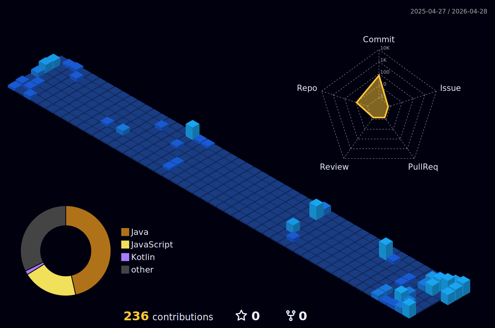

# 🌌 Nguyễn Trần Minh Tú
### 🏗️ Software Architect & Backend Strategist

*"Crafting high-performance distributed systems where every millisecond counts."*

---

## 🕒 The Pulse of My Code
*(My 3D contribution architecture visualized)*

---

# 💫 Core Identity:

Chào Tú đây! 👋 Mình là một **Backend Engineer** với niềm đam mê mãnh liệt trong việc xây dựng các hệ thống phân tán (Distributed Systems) và tối ưu hóa luồng dữ liệu phức tạp. 

Thay vì chỉ viết code để chạy, mình tập trung vào việc làm sao để hệ thống có thể chịu tải hàng triệu request và dữ liệu luôn nhất quán.

> **Technical Vision:** Chuyển mình từ một người viết code thành một **Seasoned Backend Architect** – người không chỉ xây dựng tính năng, mà còn thiết kế nên những "xương sống" kỹ thuật vững chắc cho các sản phẩm số tầm cỡ.

### 🚀 What I'm Mastering:
* 🛠️ **Microservices Orchestration:** Thành thạo việc vận hành hệ sinh thái **Spring Boot/Cloud** và **.NET Core**.
* ⚡ **Performance Optimization:** Sử dụng **Redis** làm vũ khí chiến lược để giảm độ trễ và tối ưu hóa bộ nhớ đệm.
* 📨 **Event-Driven Design:** Điều phối luồng dữ liệu bất đồng bộ qua **Kafka** và **RabbitMQ** để đảm bảo tính sẵn sàng cao của hệ thống.
* 🌐 **Full-stack Capability:** Linh hoạt trong việc triển khai **Express.js** và xây dựng giao diện tương tác hiện đại với **React.js**.

---

# 💻 Professional Tech Stack:

### ⚙️ Backend & Frameworks
   

### 🗄️ Database & Caching
   

### 📨 Message Brokers & Event Streaming
 

### 🎨 Frontend & Tools
  

---

# 📊 System Performance & Stats:

  
  
   
  

---

### ✍️ Random Dev Quote

   
  

